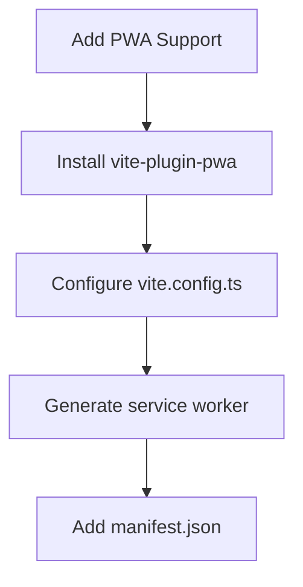
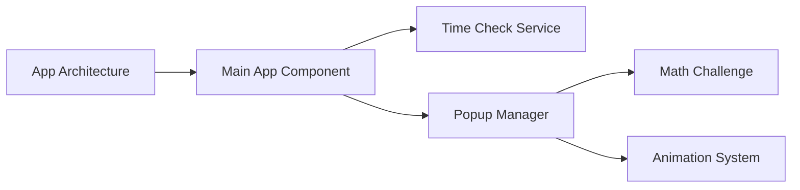
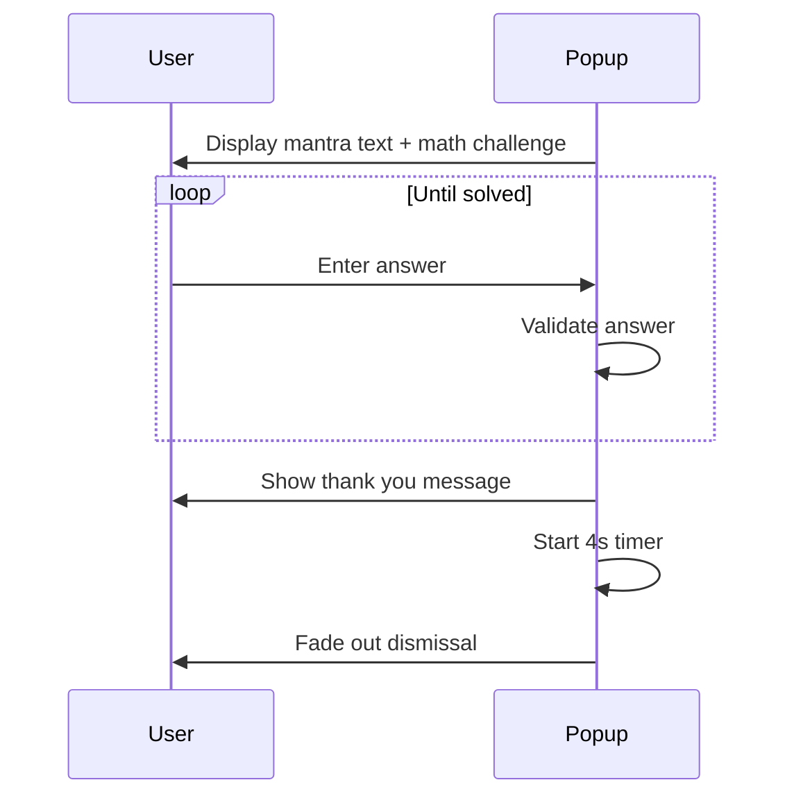

# Progressive Web App Implementation Plan

## 1. Project Setup & Dependencies


- Add dependencies: `npm install vite-plugin-pwa workbox-window`
- Configure PWA in `vite.config.ts`
- Create `manifest.json` with PWA metadata
- Preload all required Google Fonts in `index.html`

## 2. Core Application Structure


- Create `App.tsx` as root component
- Implement time checking service (12:22 PM and 4:44 PM CAT)
- Build popup component with:
  - Dynamic font loading based on day of week
  - Screen Wake Lock API integration
  - Math challenge verification
  - Animation states (flash, fade)

## 3. Popup Implementation Details

### Visual Design:
- Dark mode only (remove light mode styles)
- 80% screen coverage
- Flashing background animation (opacity 100% ↔ 50%)
- Text content with specified sizes and colors

### Interaction Flow:


## 4. Technical Components

### File Structure Updates:
```
src/
├── components/
│   ├── Popup.tsx
│   └── MathChallenge.tsx
├── services/
│   ├── timeService.ts
│   └── wakeLockService.ts
├── hooks/
│   └── useDayFont.ts
├── styles/
│   ├── popup.css
│   └── fonts.css
├── App.tsx
├── main.tsx
└── service-worker.ts
```

### Key Implementation Notes:
1. **Time Service**: 
   - Use `setInterval` to check time every minute
   - Compare against CAT time (UTC+2)
   - Trigger popup at exact times

2. **Font Handling**:
   - Map days to fonts: `{0: 'Nerko One', 1: 'Amarante', ...}`
   - Preload fonts via `<link rel="preload">`
   - Apply via CSS: `font-family: var(--day-font)`

3. **Screen Wake Lock**:
   - Implement in `wakeLockService.ts`
   - Acquire lock when popup appears
   - Release after dismissal

4. **Offline Support**:
   - Cache all assets via service worker
   - Use Workbox for precaching
   - Implement network-first strategy for time API

## 5. Development Workflow

1. Setup PWA infrastructure
2. Implement time checking service
3. Build popup component with animations
4. Add math challenge functionality
5. Integrate dynamic fonts
6. Implement screen wake lock
7. Test offline functionality
8. Optimize performance

## 6. Quality Assurance

- Test time triggers with simulated time
- Verify offline functionality
- Test on multiple screen sizes
- Validate PWA installation
- Check font loading performance
- Verify wake lock behavior